# Notes for k8s
## Main k8s components
### Pod:
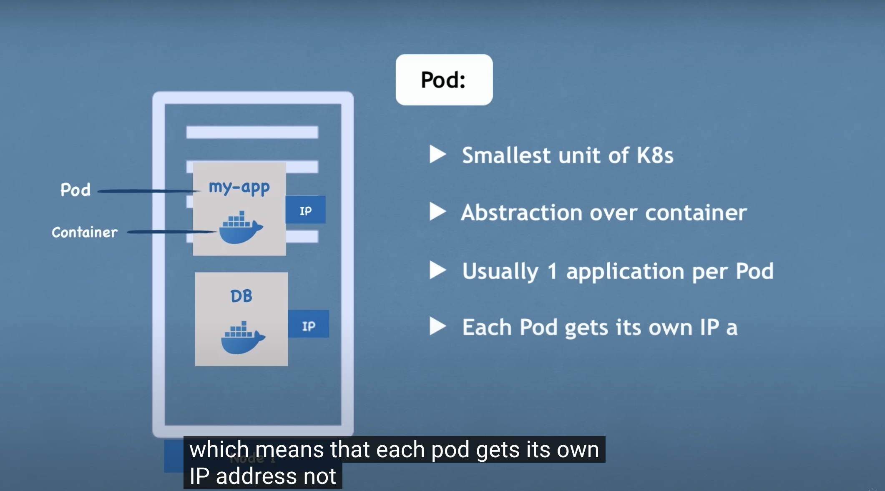

* Each pod gets 1 IP addresss
* New IP address on re-creation, when 1 pod is dead and crashed, another pod will be re-created and replace, new IP addressed will be replaced in that

### Service
* a static(permanent) IP is attached to each pod. my-app will have its own service and db will have it own service, pod and service are not connect, -> if the pod died, the service still stay alive, so dont have to change the end point


### Ingress
* Traffic will go through into ingress and then forwarding to the service


#### Step for change db name
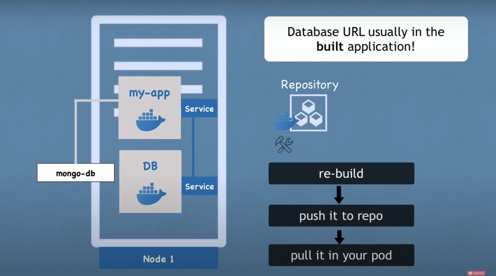

### Config map

* Do not need to rebuilt the image
* Do not put credentials into config map. Save it in ```secret```

### Secret:


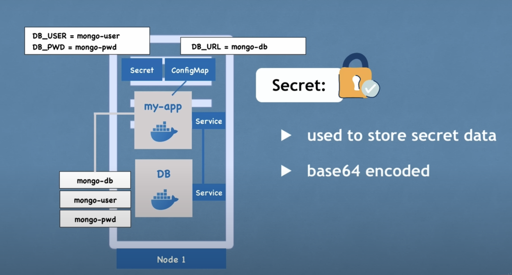

### Data storage
#### Volume


#### Replica
* Avoid application downtime and db downtime

* Service also represent as a load balancer, the service will catch the request and forward it to whichever part is list busy
* Do not need to create the replica, only need to define a blueprint (deployments)
* Defind replicas, if 1 application is down, the service will forward to another pod, then user can still continue to use
* DB cannot be replicated via Deployment because data has states
* Need to have a mechanism to avoid the inconsistence of the data, making the databases is synchronize ```StatefulSet```

* ```Deployment for stateless app```
* ```statefulset for statefull apps or databases```
* Deploying statefulset is not easy
* DB are often hosted outside of k8s cluster

### Summarize
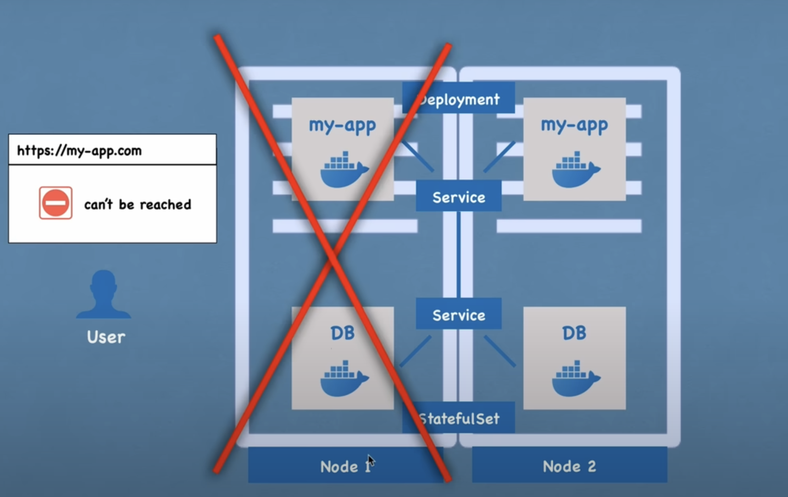


## K8s architecture
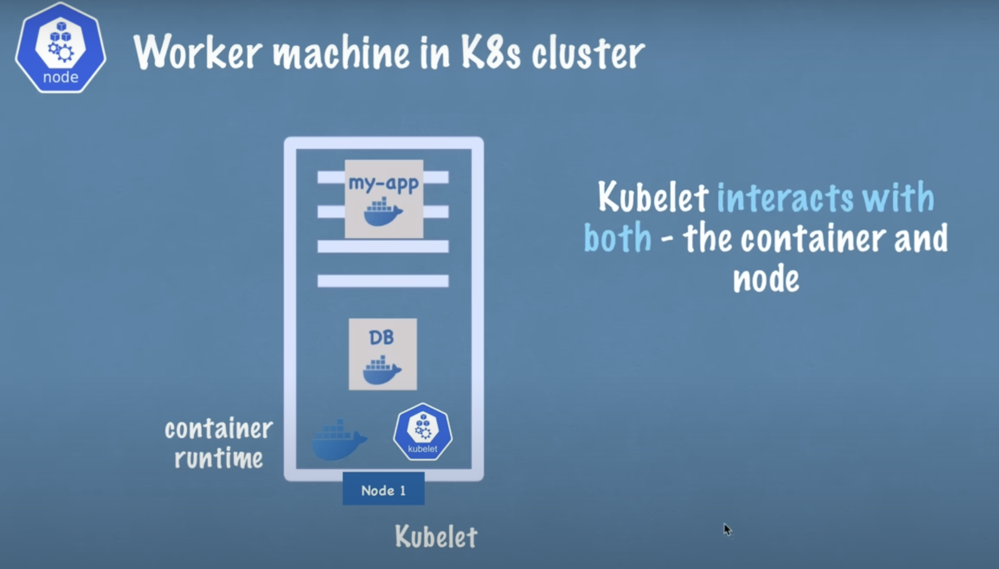
### Kubelet
* Kubelet interacts with both - the container and node
* Kubelet starts the pod with a container inside
* 1 node containes: ```pods, container runtime and kubelet```
### Kube proxy
* forwards the requests
* E.g: my-app in node 1 will send the request to db in node1, with the help of kube proxy, without sending the request to db in node2
### Container runtime

### Master nodes
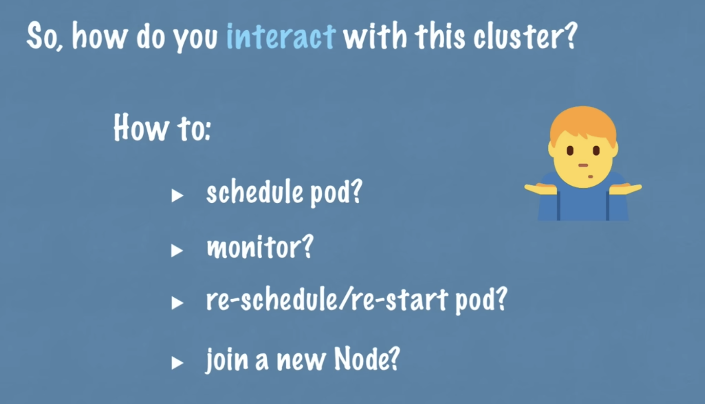

* There will be 4 processes run on master node

#### API server
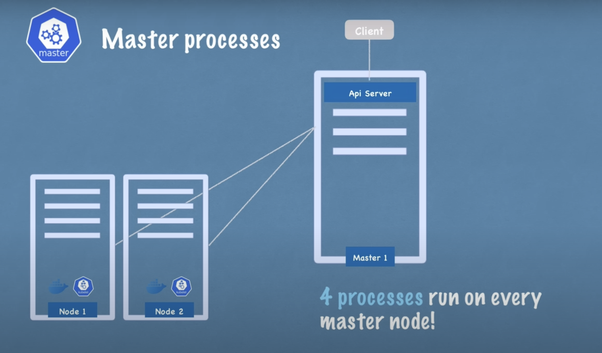
* like a cluster gateway
* acts as a gatekeeper for authentication


* Good since there are just 1 entry point enter to the cluster

### Scheduler
* have intelligence to assign which pod into the node
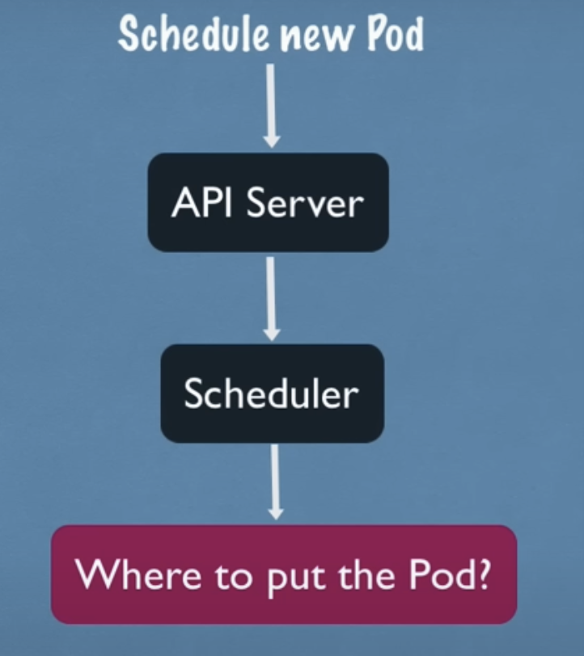

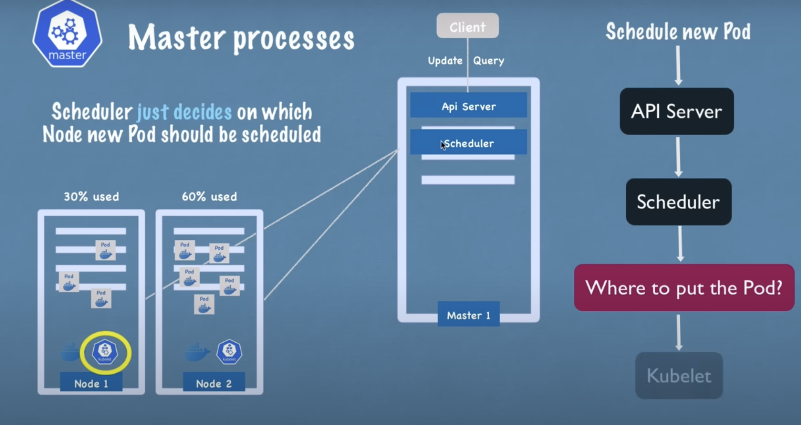
* Scheduler just decide which node will be assign a pod, but the ```kubelet``` responsible for create the pod into that node

### Controller manager
* when pods die on any nodes, detect it and reschedule those pods ASAP
* It can detects cluster state changes
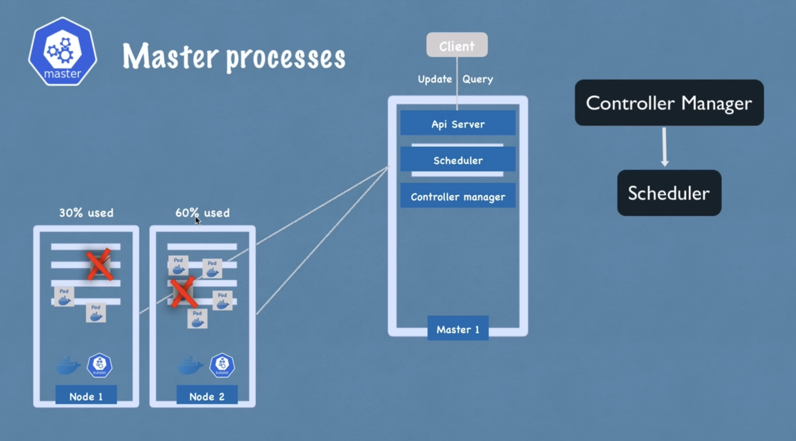

### etcd
* a key-value store
* can be considered as a cluster brain
* Cluster changes get stores in the key value store. E.g: if a pod dies means that the cluster changed, then the etcd will get store in the key value
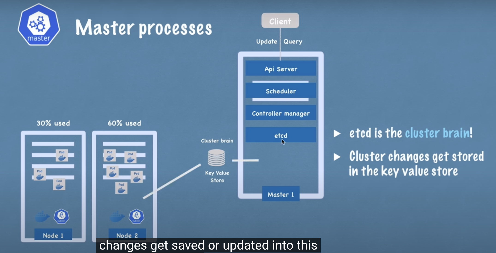

* ``` application data not stored in etcd ```
* ``` etcd only store cluster states change in order to make the master node able to communicate with slave nodes```

### practical example

* API server are load balanced
* Distributed storage across all master nodes

### Example set up
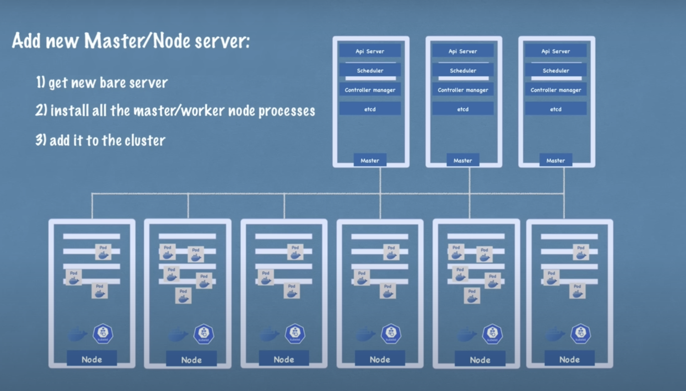

## Minikube and kubectl setup